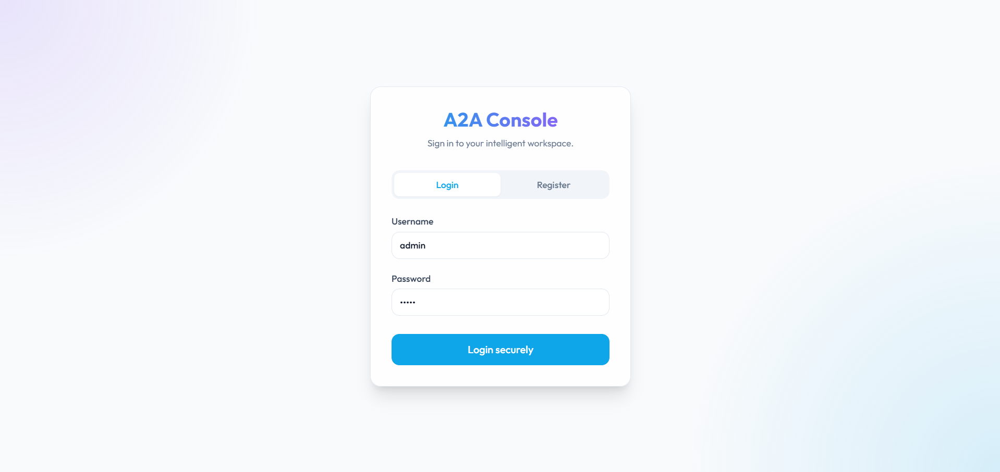
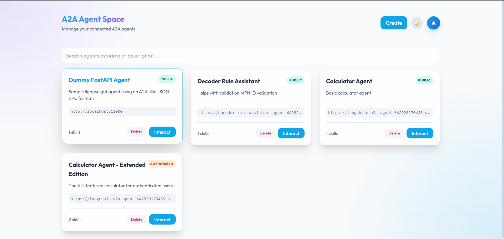
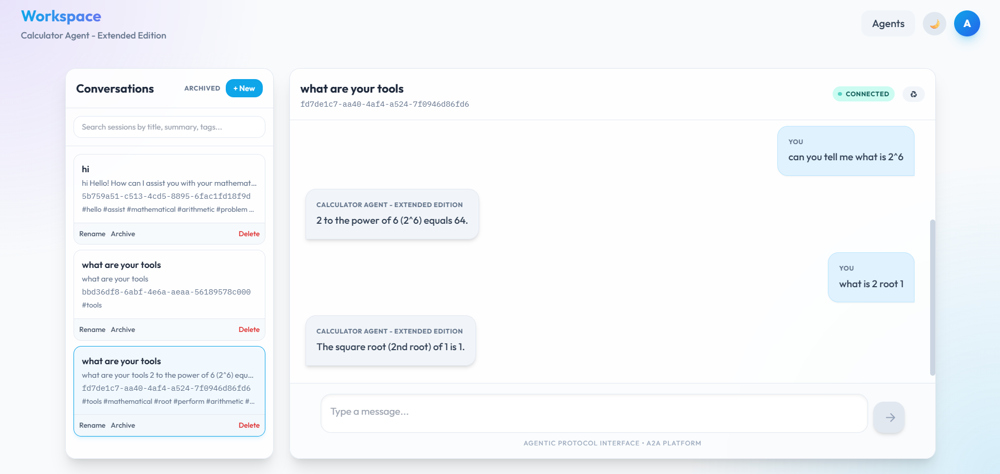

# A2A Agent Workspace

Web application for discovering, connecting, and chatting with hosted agents through:

- standard A2A agents
- lightweight A2A-like agents that expose:
  - `GET /.well-known/agent-card.json`
  - `POST /` with a JSON-RPC message contract

The project provides:

- user login and registration
- persistent agent connections per user
- public and authorized agent modes
- persistent chat sessions and history
- agent comparison in the playground
- support for both A2A transport and a lightweight JSON-RPC fallback

## UI

### Login



### Agents



### Chat



## How It Helps With A2A Agents

This project acts as a single UI and backend for interacting with multiple agents.

For A2A agents it:

- fetches the agent card from `/.well-known/agent-card.json`
- stores agent metadata and supported skills
- supports public and authorized modes
- creates chat sessions mapped to A2A `context_id`
- streams or retrieves responses and stores chat history

For non-A2A agents it can also talk to agents that implement the same high-level shape:

- card discovery at `/.well-known/agent-card.json`
- message send at `/`
- JSON-RPC request/response envelope

Current transport behavior:

1. try A2A transport
2. if that fails, fall back to the lightweight JSON-RPC contract

That lets the workspace handle both full A2A agents and simpler compatible agents.

## Project Structure

- `backend/`: FastAPI backend, SQLAlchemy ORM, auth, agent/session APIs
- `frontend/`: React + Vite frontend
- `a2a_langchain_agent_advanced/`: sample A2A calculator agent with public/authorized modes
- `dummy_fastapi_agent/`: sample lightweight agent with A2A-like card and JSON-RPC messaging

## Prerequisites

Required:

- Python `3.12+`
- `uv`
- Node.js `20+`

Optional:

- Docker and Docker Compose

## Local Setup With `uv`

### 1. Backend

```bash
cd backend
copy .env.example .env
uv sync
uv run main.py
```

Backend starts on:

- `http://localhost:8000`

Notes:

- tables are created automatically through SQLAlchemy metadata on startup
- a default user is created on startup:
  - username: `admin`
  - password: `admin`

### 2. Frontend

```bash
cd frontend
copy .env.example .env
npm install
npm run dev
```

Frontend starts on:

- `http://localhost:5173`

### 3. Sample A2A Agent

```bash
cd a2a_langchain_agent_advanced
copy .env.example .env
uv sync
uv run .
```

Sample A2A agent:

- `http://localhost:10000`

### 4. Sample Lightweight Agent

```bash
cd dummy_fastapi_agent
uv sync
uv run .
```

Sample lightweight agent:

- `http://localhost:11000`

## Docker Setup

The repo also includes:

- `backend/Dockerfile`
- `frontend/Dockerfile`
- `docker-compose.yml`

Run:

```bash
docker compose up --build
```

Notes:

- backend runtime config is loaded from `backend/.env`
- frontend build-time config is loaded from `frontend/.env`
- if you change `frontend/.env`, rebuild the frontend image

## Connecting Agents

From the UI:

1. login
2. open the agents page
3. add a hosted agent URL
4. choose mode:
   - `public`
   - `authorized`
5. if authorized mode is selected, provide the secure token

The backend:

- resolves the agent card
- stores the agent metadata
- checks availability
- keeps user-specific agent connections separate

## Supported Agent Shapes

### A2A

Expected:

- `/.well-known/agent-card.json`
- A2A-compatible message handling

### Lightweight JSON-RPC

Expected:

- `GET /.well-known/agent-card.json`
- `POST /`

Minimal supported method:

- `message/send`

Minimal request example:

```json
{
  "jsonrpc": "2.0",
  "id": "1",
  "method": "message/send",
  "params": {
    "message": {
      "messageId": "m-1",
      "contextId": "ctx-1",
      "role": "user",
      "parts": [
        {
          "kind": "text",
          "text": "hello"
        }
      ]
    },
    "configuration": {
      "blocking": true
    }
  }
}
```

Minimal response example:

```json
{
  "jsonrpc": "2.0",
  "id": "1",
  "result": {
    "status": "completed",
    "isTaskComplete": true,
    "requireUserInput": false,
    "message": {
      "messageId": "resp-1",
      "contextId": "ctx-1",
      "role": "agent",
      "parts": [
        {
          "kind": "text",
          "text": "Hello from the agent"
        }
      ]
    }
  }
}
```

## Development Notes

- backend auth is JWT-based with access and refresh tokens
- sessions are persisted with the agent conversation context id
- agent status checks are cached and refreshed asynchronously
- the playground compares multiple agents against the same prompt without persisting the run

## Recommended Next Step

If you plan to onboard third-party non-A2A agents, define and publish a small protocol spec for the lightweight JSON-RPC profile. Right now the code supports it, but a written contract will keep integrations stable.
